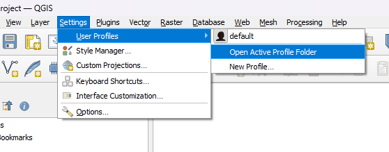
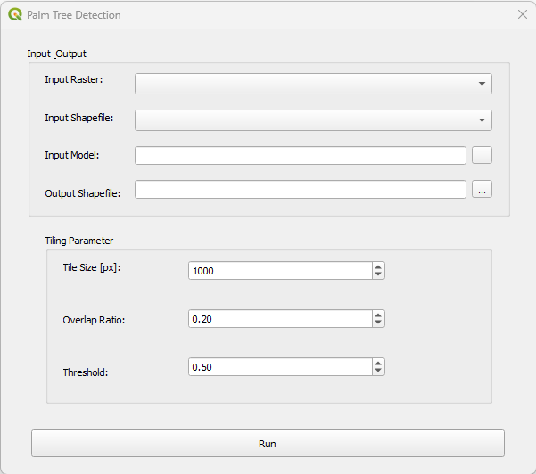
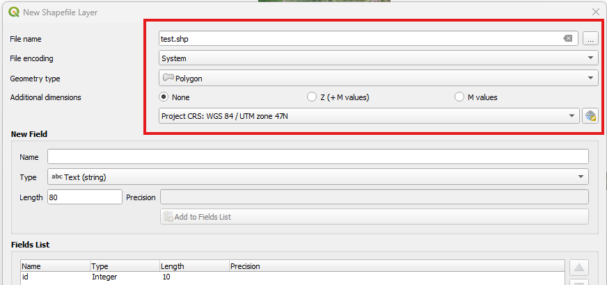
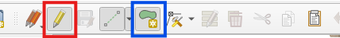

# SawitAI Plugin

<p align="center">
    
</p>

SawitAI Plugin is a QGIS plugin for automatic oil palm tree detection from UAV orthomosaic imagery using YOLO object detection models and SAHI sliced inference. The plugin allows users to detect palm trees within a user-defined Area of Interest (AOI) and export detection results as a vector layer.

---

## Features

- Palm tree detection from orthomosaic imagery
- Supports custom YOLO (.pt) models
- Area of Interest (AOI) based processing using shapefile boundaries
- SAHI sliced inference for large raster datasets
- Export detections as ESRI Shapefile
- Integrated directly into QGIS

---

## Installation

### 1. Download Plugin

Download:

- Plugin from this repository
- [YOLO Detection Model (.pt)](https://drive.google.com/drive/folders/1QQAHuHO4mIadeDOd0AlY09XQNrnXymII?usp=sharing)

### 2. Install Plugin

Open your QGIS profile folder:

<p align="center">
    
</p>

```text
Settings → User Profile → Open Active Profile Folder
```

Navigate to:

```text
python/plugins
```

Extract the plugin folder into the plugins directory.

Example:

```text
QGIS Profile
└── python
    └── plugins
        └── palm_tree_detection
```

### 3. Install Python Libraries

Open OSGeo4W Shell inside QGIS folder and install:

```bash
pip install rasterio==1.3.10
pip install geopandas==0.14.0
pip install sahi==0.11.18
pip install shapely==2.0.5
pip install ultralytics==8.4.128

pip uninstall torchvision torch torchaudio

Install pytorch, https://pytorch.org/get-started/locally/
```

Restart QGIS.


### 3. Enable Plugin

Open:

```text
Plugins → Manage and Install Plugins
```

Enable:

```text
Palm Tree Detection
```

---

## User Interface

<p align="center">
    
</p>

### Input Raster (.tif)

Input orthomosaic raster layer already loaded in QGIS.

### Input Shape (.shp)

Polygon shapefile representing the Area of Interest (AOI).

### Input Model (.pt)

YOLO model used for palm tree detection.

### Output Shapefile (.shp)

Location where detection results will be saved.

### Tile Size [px]

Image tile size used during sliced inference.

Larger values generally increase processing speed but require more memory.

### Overlap Ratio

Overlap percentage between image tiles.

### Threshold

Confidence threshold used to filter predictions.

Only detections above this value will be saved.

### Run

Starts the detection process.

---

## Usage

### Step 1

Load:

- Raster layer (.tif)
- AOI shapefile (.shp)

into QGIS.

### Step 2

Select:

- Input Raster
- Input Shape
- YOLO Model

### Step 3

Choose output location.

### Step 4

Configure detection parameters:

| Parameter | Description |
|------------|------------|
| Tile Size | Size of image tiles |
| Overlap Ratio | Tile overlap |
| Threshold | Confidence threshold |

### Step 5

Click Run

The plugin will generate a point shapefile containing detected palm trees.

---

## Creating an AOI Shapefile

Follow these steps to create an Area of Interest (AOI) shapefile for detection:

### 1. Create a New Shapefile Layer

In QGIS, create a new shapefile layer.

<p align="center">
  
</p>

### 2. Set Geometry Type to Polygon

Select **Polygon** as the geometry type and configure the layer settings.

<p align="center">
  
</p>

### 3. Use the Same CRS as the Raster

Ensure that the shapefile uses the same Coordinate Reference System (CRS) as the input raster.

### 4. Enable Editing and Draw the AOI Boundary

- Click **Toggle Editing** (red).
- Use **Add Polygon Feature** (blue) to draw the Area of Interest (AOI).

<p align="center">
  
</p>

### 5. Save the Shapefile

---

## Common Errors

### Input Shape does not overlap raster

Cause:

- AOI polygon does not intersect the raster
- CRS mismatch between raster and shapefile

Solution:

1. Check raster CRS
2. Check shapefile CRS
3. Recreate or reproject the AOI

---

### Expected input 3 channels, but got 4 channels

Cause:

The raster contains more than three bands.

Example:

- RGB + Alpha
- RGB + NIR

Solution:

Use:

```text
Processing Toolbox
→ GDAL
→ Raster Conversion
→ Rearrange Bands
```

Create a raster containing only:

```text
Band 1 = Red
Band 2 = Green
Band 3 = Blue
```

---

## Acknowledgements

SawitAI Plugin utilizes the following open-source frameworks:

- SAHI (Slicing Aided Hyper Inference) for efficient sliced inference on large orthomosaic imagery.
- Ultralytics YOLO for palm tree detection.

## License

This project utilizes:

- SAHI (MIT License) 
- Ultralytics YOLO (AGPL-3.0)